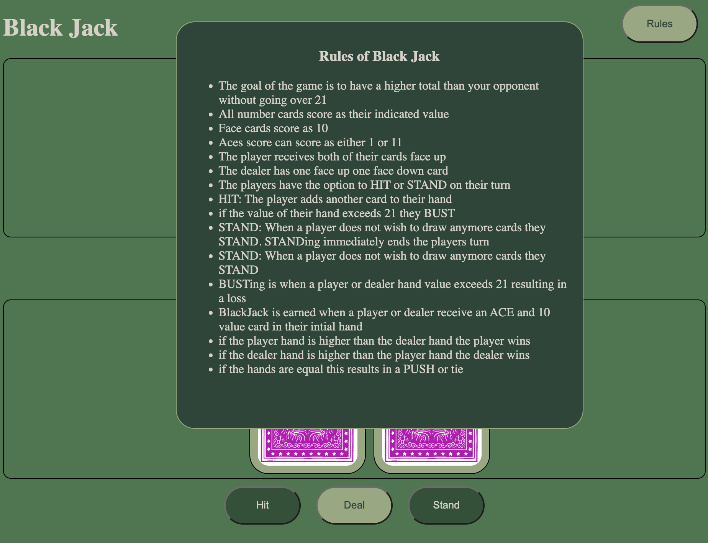
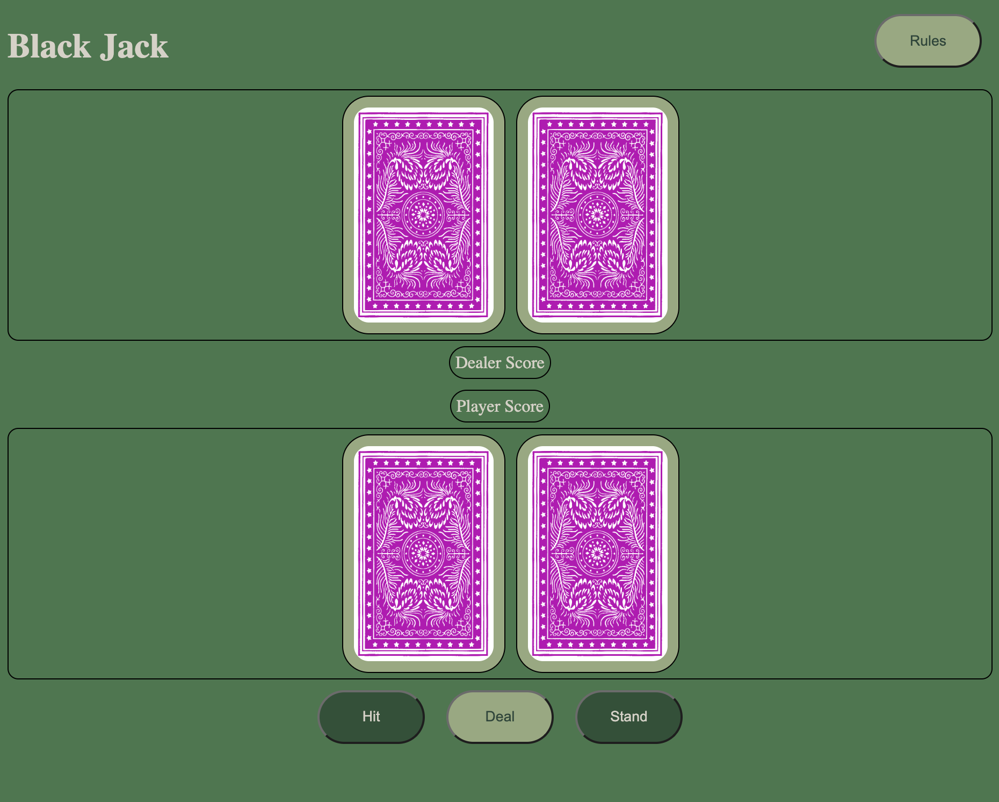
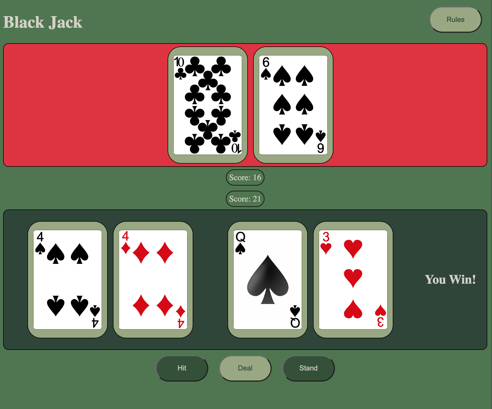
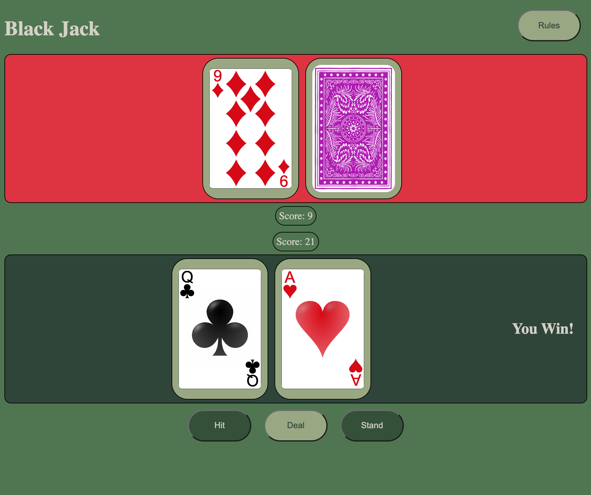

# Black Jack
## Getting Started

## Background information
- Game Choice: BlackJack
- The goal of the game is to have a higher total than your opponent without going over 21
- Rules:
    - Players bet at the beginning of each round
    - All number cards score as their indicated value
        - Face cards score as 10
        - Aces score can score as either 1 or 11
    - The player receives both of their cards face up
        - The dealer has one face up one face down card
    - The players have the option to HIT or STAND on their turn
        - HIT: The player adds another card to their hand
            - if the value of their hand exceeds 21 they BUST
        - STAND: When a player does not wish to draw anymore cards they STAND
            - STANDing immediately ends the players turn
    - BUSTing is when a player's or dealer's hand value exceeds 21
        - when a player BUSTs they immediately lose their bet
        - when the dealer BUSTs all players who did not BUST receive their bet
    - a BLACKJACK is earned when a player or dealer receive an ACE and 10 value card in their initial hand
    - if neither the dealer nor players have BUST then their hand values are compared
        - if the player hand is higher than the dealer hand while still <= 21 the player wins their bet
        - if the dealer hand is higher than the player hand while still <= 21 the player loses their bet
        - if the hands are equal this results in a PUSH the original bet is returned to the player
## Wireframe


## PseudoCode
```
    const player = {
        hand = [],
        chipCount = null
    }
    const dealerHand = []

    function dealCards ()
        - give 2 cards to the player and the dealer
            - alternate in giving
            - cardValue Math.random between 2 - 11
        - store the value of the each hand in the proper array
        - check for blackjack

    function aces ()
        - if player busts with 11 in their array
            - replace 11 with 1

    function handBust (handTotal)
        - if handTotal > 21
        - return handTotal = 0
    
    function hitCard (handTotal)
        - add another card to array
        - sum value of cards in array for hand total
        - handBust function
    
    function stand (dealerTurn)
        - ends player turn
        - starts dealer turn
            - hit if total under 15

    function compareHands(playerHand, dealerHand) 
        - provided neither player busted
            - if playerHand > dealerHand
                - player wins
                - player.chipCount += betAmount
                - reset betAmount
                - reset hands
            - else if dealerHand > playerHand
                - dealer wins
                - player.chipCount -= betAmount
                - reset betAmount
                - reset hands
            - else 
                - dealerHand total == playerHand total
                - reset betAmount
                - reset hands
   
   function newGame ()
    - reset player chip count
    - redeal current hand         

```
### Game Play Screen Shots
- Rules Pop Out Button

- Start Screen

- Multiple Cards

- Win Lose

### Technologies Used
- HTML, CSS, JavaScript
- Deck sourced from https://code.google.com/archive/p/vector-playing-cards/
### 